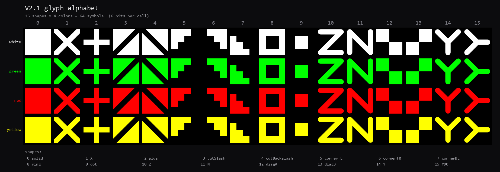

# QR Data Transmit — optical screen→camera data link

######   **HUMAN WRITTEN**   ######
Why the project was left half-finished:
My goals were to reach 1 Mbit per second (125kb/s) transfer speed, and to transfer a real file from the pc to the phone. Both are done now. To truly finish the project, I would need to finalize the web transmitter + the python transmit.py, to re-write the iOS app to be user-friendly (currently very animalistic), to write and test an Android app, to host the web page for public...

This is released with BSD-3-Clause. Basically MIT, but the LICENSE-file you'd distribute must name Github@Avadaa.

Looking at the frames is bad for your eyes, don't do it.

The transmission reached 126 kilobytes per second (~1Mbit/s) on iPhone 14 Pro + Macbook 14inch. There is still a decent amount of space without going for the DCT coefficient cell -path. You could drop the glyph size to 10px, up the glyph alphabet to 2x or 4x, and possibly tweak the camera code to take 60fps instead of the current max 30fps.

Steps:

0. Get the transmit.py or the web transmitter ready, and the iOS app loaded to your phone
1. Start with 16px glyphs, low fps, point the phone at the screen, use mid-brightness
2. Show the training QR code, let the phone calibrate the camera (might take a few tries, the default model SHOULD detect a few thousand glyphs out of the box on 16px)
3. Start the training, wait for ~sub 1%, sub 2% errors, preferably sub 0.5%
4. Finish training, show the arming QR
5. Cross your fingers and start live transmit, compare end md5 hashes

For the duration of the project (5 days), this project holds a crazy amount of optimization, architectural tweaks (camera, phone neural engine, neural networks...), and would've taken a human quite a bit longer to develop. Naturally the code is AI (Fable) -written. A human has been guiding, challenging and micromanaging the decisions from start to finish.

Future todos:  
-Glyph optimization / alphabet additions. The NN can take a bigger alphabet, so one could carry some more data.  
-Android app  
-iOS app GUI patching, currently the horizontal mode doesn't show all the buttons, so one needs to flip between the horizontal and vertical to access some functionalities  
-iOS: Training frame detections to be more efficient  
-V3.1 enhancements and testing for it to be actually useful to the point that it could replace V2 glyph transmission
######   **HUMAN WRITTEN ENDS**   ######

*The v2 wire's alphabet: each cell on the screen is one of these 64 glyphs (16
shapes × 4 colors), carrying 6 bits. The phone's neural net classifies every
cell in a frame. (The v3.1 wire replaces glyphs with DCT-coefficient cells for
more bits/cell — see [docs/WIRE.md](docs/WIRE.md).)*

Send files from any screen to an iPhone camera at up to **126 KB/s measured**
(300+ KB/s projected for the v3.1 wire) with no network, no pairing, no radio:
the screen flashes a grid of machine-readable cells, the phone films it and a
small neural net decodes every frame. Reed-Solomon + a fountain code make the
link lossless — a finished transfer is byte-perfect (md5-verified) or it isn't
delivered at all.

**This is a working research prototype, not a product.** One developer rig
(PC/mac transmitter + iPhone 14 Pro), a dev-signed iOS app full of
research UI, and honest gaps — see [docs/STATUS.md](docs/STATUS.md) for exactly
what was proven and what never ran. Highlights that ARE proven, byte-perfect,
on real hardware:

- **126.6 KB/s** sustained (1 MB in 8.1 s) — 12 px cells read at 16×16 through
  the Neural Engine, 30 fps display
- **6.4 MB mp3** and a **576 KB PDF** delivered end-to-end into the iOS Files
  app, md5-exact, with in-flight neural retraining defeating thermal drift
- On-device training: the phone fine-tunes its decoder DURING the transfer
- v3.1 "modem" wire (DCT cells instead of glyphs): **0.16 % bit error on real
  footage** offline — 2× the glyph wire's capacity — phone decode implemented
  but not live-tested in a successful manner.

## How it works (one paragraph)

The transmitter renders frames of colored cells inside a white ring: 49 header
tiles carry the frame index (7-fold redundant + CRC), the rest carry payload
bytes as either 6-bit **glyphs** (16 shapes × 4 colors, wire v2) or **DCT
coefficient cells** (PAM-modulated frequency-domain values, wire v3.1). QR codes
before/after the stream carry the session plan (grid, sizes, RS strength, file
name). The phone finds the ring, fits a homography, samples every cell and
classifies it with a ~90 k-parameter CNN (Neural Engine, ~16 ms per frame, with
the model **re-minted on device for any grid size**). Reed-Solomon corrects
symbol errors per frame; XOR fountain frames rebuild lost frames; whitening
prevents content-shaped bright floods. The decoder net is picture-pretrained on
a PC and fine-tuned in seconds by the phone itself, using seeded training frames
whose ground truth both sides can generate.

## Repository layout

| folder | what |
|---|---|
| [`transmitter/`](transmitter/) | Python/pygame fullscreen transmitter (`transmit.py`) — the original, most-tested path |
| [`web/`](web/) | Single-file browser transmitter — no install, bit-exact with the Python one, use the V2 glyphs at first |
| [`ios/`](ios/) | The receiver app (SwiftUI + Accelerate + CoreML + Metal, no third-party deps) + camera-tuned models |
| [`training/`](training/) | PC pretraining: picture-training for glyph nets, the full v3.1 real-footage pipeline |
| [`models/`](models/) | Base pretrained weights (raw fp32) for both wires |
| [`laptop_as_receiver/`](laptop_as_receiver/) | The FIRST receiver generation (Python/torch on a Windows tablet) — superseded by iOS, kept as reference + era docs |
| [`docs/`](docs/) | [STATUS.md](docs/STATUS.md) (tested vs not), [WIRE.md](docs/WIRE.md) (format spec), [engineering_log.md](docs/engineering_log.md) (the full dated ledger) — start at [docs/README.md](docs/README.md) |

## Quickstart (the proven path)

1. **Receiver**: build + install `ios/` on an iPhone (see [ios/README.md](ios/README.md) —
   needs a Mac with Xcode; free personal signing works).
2. **Transmitter**: open `web/index.html` in a browser fullscreen on a semi/mid bright
   monitor (defaults are sane), or run `python transmitter/transmit.py`.
3. Put the phone on a stable setting ~30–60 cm from the screen. **The camera must be
   ABSOLUTELY stable** — even micro-shakes wreck training, recognition and the
   cached geometry. Enable the 4K capture toggle in app Settings: **4K greatly helps 
   recognition even at 16 px tiles**, and is mandatory below that.
4. Phone: **Receive**. Web page: walk the stages with the buttons or Enter —
   TRAIN QR → training frames (the phone fine-tunes itself) → arm QR →
   live data → END.
5. The phone prints per-run stats and md5; a complete file lands in
   Files → On My iPhone → QR File Transmit → QR Transmit.

Start with **16 px tiles, wire v2, nsym 64, 5–10 fps**; push px down / fps up
after the first clean run. The neural-net and wire options are explained in
[models/README.md](models/README.md) and [docs/WIRE.md](docs/WIRE.md).

## What this needs to become "finished" (roadmap)

- A real UI on both ends (the iOS app is a research console; `transmit.py` is
  keyboard-driven and minimal)
- v3.1 live end-to-end run + ANE port of the demapper (offline numbers say
  ~2× throughput at the same fps)
- Android receiver (nothing exists; the NN + wire are platform-neutral)
- Handheld operation (architecture built and field-tested, never survived a
  real handheld transfer - see STATUS)
- Auto-negotiation (px/fps/nsym are still chosen by hand)